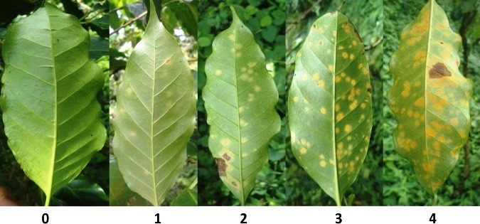

# Coffee Leaf Rust Dataset
Three month Coffee Leaf Rust dataset generated by the Cyber Physical Data Collection System.

## Folder structure

The `data` folder contains five folders (`0`, `1`, `2`, `3`, `4`) previously labeled by the Universidad EAFIT Biology Team, indicating the severity of the Coffee Leaf Rust development stage. The CLR development stage corresponds to the following figure:

De Melo Virginio Filho, E.; Astorga, C. _Prevención y Control de la Roya del Café: Manual de Buenas Prácticas para Técnicos y Facilitadores_, 1st ed.; CATIE: Turrialba, Costa Rica, 2015; p. 67.

Inside each tagged folder, there are multiple folders with the name `lot_#` corresponding to a `#` sample of a lot. This `lot` folder contains inside the following folders and files:

- `rgb_images`: folder containing the RGB images of the corresponding plants. This folder includes another five sub-folders (`0`, `1`, `2`, `3`, `4`) with the CLR development stage label for each plant used to train a separate RGB model.
- `lot_#.json`: file containing all the sensor information from the `#` lot.
- `re.jpg`: Multispectral Camera with Red Edge filter picture of the corresponding lot.
- `rgn.jpg`: Multispectral Camera with Red+Green+NIR picture of the corresponding lot.
